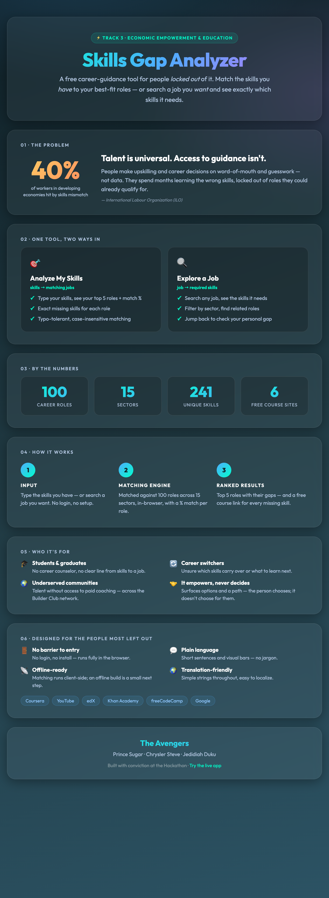

# Skills Gap Analyzer

> Two ways in: enter the skills you **have** to find your best-matching career roles — or search a job you **want** and see exactly which skills it needs. Every missing skill comes with a free course link.

<p align="center">
  <a href="https://jedidiahduku.github.io/SkillsGapAnalyzer/">
    
  </a>
</p>

> 🖼️ The infographic above is also a standalone page — open [`infographic.html`](infographic.html) in a browser.

Built at a hackathon by **The Avengers** under *Track 3: Economic Empowerment & Education*.

**🔗 Live demo:** https://jedidiahduku.github.io/SkillsGapAnalyzer/

---

## Why it exists

Talent is universal; access to career guidance is not. In many underserved communities people make upskilling decisions on word-of-mouth and guesswork, spend months learning the wrong skills, and stay locked out of roles they could already qualify for. The ILO estimates ~40% of workers in developing economies are affected by skills mismatch.

Skills Gap Analyzer turns that guesswork into data — instantly, with no login.

---

## What it does

The app runs **entirely in the browser** (a single self-contained `index.html`), so results are instant and it works on a static host like GitHub Pages.

### 🎯 Analyze My Skills (skills → jobs)
- Type the skills you have (comma-separated) or pick them from the **skills browser**.
- See your **top 5 matching roles**, each with a **match %** and the **exact missing skills**.
- **Case-insensitive** matching and **typo-tolerant** correction (e.g. `pyton` → `Python`) via Levenshtein distance, with a "Did you mean?" prompt.
- Every gap links out to **free learning** — Coursera, YouTube, edX, Khan Academy, freeCodeCamp, and Google.

### 🔍 Explore a Job (jobs → skills)
- Search the job you *want* with a typo-tolerant **autocomplete** (keyboard ↑/↓/Enter supported).
- See that role's **core skills**, each linking to a course search.
- **Filter by sector** across 15 industries.
- See **related roles** that share skills — useful for spotting career pivots.
- **"Check my gap for this role"** jumps into the analyzer pre-filled with that role's skills, so you delete the ones you don't have and instantly see your gap.

### Dataset
**100 roles** across **15 sectors** (Technology & Data, Healthcare, Engineering, Legal, Skilled Trades, Creative & Media, and more), each defined by 5 core skills. See [`jobs_dataset.json`](jobs_dataset.json).

---

## How it works

| Step | What happens |
|------|--------------|
| **1 · Input** | User types skills they have — or searches a job they want. No account needed. |
| **2 · Matching engine** | Skills are matched against 100 roles across 15 sectors; a `% match = (matched ÷ required) × 100` is computed in-browser, with case-insensitive + typo-tolerant detection. |
| **3 · Ranked results** | Top 5 roles by match score, each with its missing skills and a free course link per gap. |

The same logic is also available as an optional **Flask API** (see below) for programmatic use.

---

## Project structure

```
SkillsGapAnalyzer/
├── index.html                      # The app — self-contained static site (HTML/CSS/JS). Deployed to GitHub Pages.
├── jobs_dataset.json               # 100 roles → required skills
├── app.py                          # Optional Flask API mirroring the matching logic
├── infographic.html / .png         # One-page project infographic (poster + rendered image)
├── SkillsGapAnalyzer_Pitch.pptx    # 8-slide pitch deck (16:9)
├── deck/                           # Editable deck source (HTML slides + generator scripts)
├── pom.xml / src/                  # Spring Boot scaffold (experimental, not required to run the app)
└── README.md
```

---

## Running locally

### The web app (no build step)
It's a single static file — just open it:

```bash
# Option A: open directly
open index.html

# Option B: serve it (any static server works)
python3 -m http.server 8000
# then visit http://localhost:8000/index.html
```

### The Flask API (optional)

```bash
pip install flask flask-cors
python3 app.py        # serves on http://localhost:5001
```

**Endpoints**

| Method | Route | Purpose |
|--------|-------|---------|
| `POST` | `/analyze` | Body `{"skills": ["Python","SQL"]}` → top 5 roles with `match` % and `gap` list |
| `GET`  | `/jobs` | Full dataset: every role and its required skills |
| `GET`  | `/job?role=Nurse` | Reverse lookup: skills for a job (case-insensitive, partial match supported) |

```bash
# examples
curl -X POST http://localhost:5001/analyze \
  -H "Content-Type: application/json" \
  -d '{"skills":["Python","SQL","Excel","Statistics"]}'

curl "http://localhost:5001/job?role=Data%20Analyst"
```

---

## Accessibility & ethics

Designed for the lowest possible barrier to entry:
- **No login, no install** — runs fully in the browser, even off a static host.
- **Plain language** output and visual progress bars — no jargon.
- **Translation-friendly** dataset and UI (simple, short strings throughout).
- Because matching runs client-side with no server, a **fully offline build** is a small next step.

---

## The Avengers

Prince Sugar · Chrysler Steve · Jedidiah Duku
